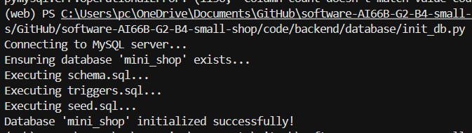
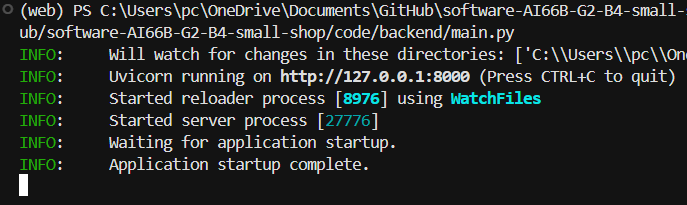
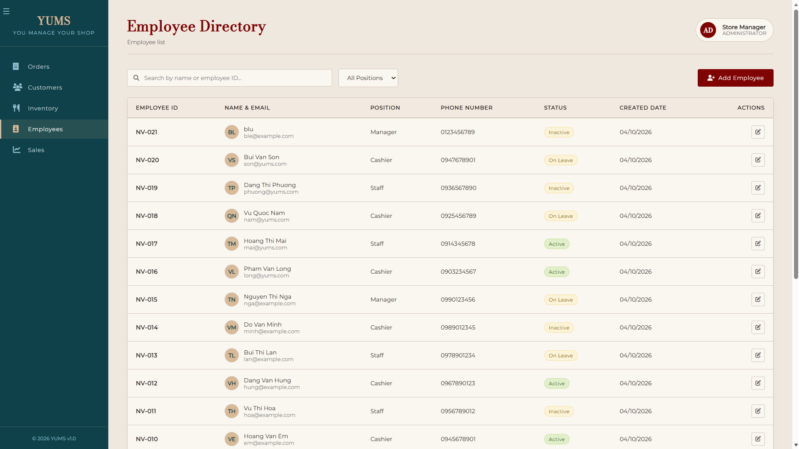

# Setup Guide
*There is a **Quick Start Summary** below if you don't want to read all the text.*

## Prerequisites

Before running the application, make sure the following software is installed on your machine:

- Python 3.12
- MySQL Server
- Git (optional, for cloning the repository)

Verify your installations:

```bash
python --version
mysql --version
```

---

## 1. Navigate to the Project Directory

Open a terminal and move to the project folder:

```bash
cd code
```

---

## 2. Create and Activate a Python Virtual Environment

Create a virtual environment using Python 3.12:

```bash
python -m venv .venv
```

Activate the virtual environment:

### Windows (PowerShell)

```powershell
.\.venv\Scripts\Activate.ps1
```

### Windows (Command Prompt)

```cmd
.venv\Scripts\activate.bat
```

### Linux / macOS

```bash
source .venv/bin/activate
```
### Or with Anaconda
**Create new environment**
```bash
conda create -name yums python=3.12
```
**Activate environment**
```bash
conda activate yums
```
---

## 3. Install Backend Dependencies

Install all required Python packages:

```bash
pip install -r backend/requirements.txt
```

---

## 4. Configure Environment Variables

Copy the example environment file:

### Windows

```cmd
copy backend\.env.example backend\.env
```

### Linux/macOS

```bash
cp backend/.env.example backend/.env
```

Open `backend/.env` and update the MySQL connection settings, especially:

```env
DB_HOST=localhost
DB_PORT=3306
DB_USER=root
DB_PASSWORD=change_to_your_password
DB_NAME=mini_shop
```

Replace `change_to_your_password` with your actual MySQL password.

---

## 5. Initialize the Database

Run the database initialization script **(!!! run only once !!!)**:

```bash
python backend/database/init_db.py
```

This script will create the required database tables and seed any initial data. If success, your terminal should show:



---

## 6. Start the Backend Server

Run the main application:

```bash
python backend/main.py
```

Keep this terminal window running while testing the application. Your terminal should look like this:



---

## 7. Open the Frontend

Open the following file in your web browser:

```text
code/frontend/html/employees.html
```

You can open it by:

- Double-clicking the file, or
- Opening it directly from your browser

Your screen should look like this if success:


---

## 8. Verify the Application

Test the following features:

### Add Employee

1. Open `employees.html`
2. Click **Add Employee**
3. Fill in the employee information
4. Submit the form
5. Verify that the new employee appears in the employee list

### Update Employee

1. Click the **pen icon** at the row of any existing employee
2. Modify employee details
3. Save changes
4. Verify that the updated information is displayed correctly

**Every changes you made on the UI will also be changed in the database. Verify it by type this queries into MySQL Query GUI**

```SQL
select * from employees;
```
---

## Troubleshooting

### MySQL Connection Error

Check that:

- MySQL Server is running
- The credentials in `backend/.env` are correct
- The configured database user has permission to create and modify databases
- The current directory matches the command's file path. If you are in `../software-AI66B-G2-B4-small-shop>`, use pip install `-r code/backend/requirements.txt`.Adjust other paths accordingly

### Missing Python Packages

Reinstall dependencies:

```bash
pip install -r backend/requirements.txt
```

### Backend Fails to Start

Verify:

- Python version is 3.12
- Virtual environment is activated
- `.env` file exists and contains valid values
- Database initialization completed successfully

---

## Quick Start Summary

```bash
cd code

python -m venv .venv

.\.venv\Scripts\activate

pip install -r backend/requirements.txt

copy backend/.env.example backend/.env

# Update MySQL password in backend\.env

python backend/database/init_db.py

python backend/main.py
```

Then open:

```text
code/frontend/html/employees.html
```

and test:

- Add Employee
- Update Employee
