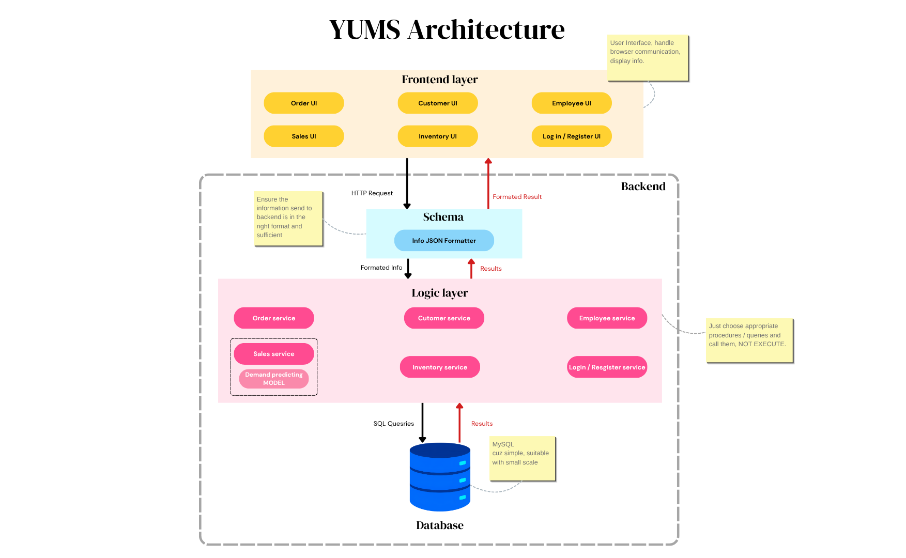
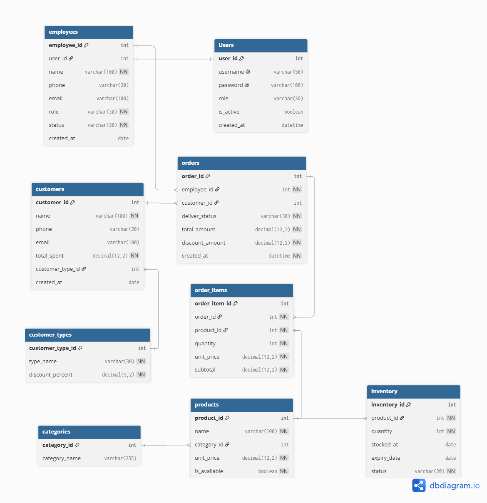

# Milestone 2 - Walking skeleton
## Architecture

## Data model

| Table              | Columns                                                                                                                         | Constraint · which M1 rule                                                                                                                                                                                                      |
| ------------------ | ------------------------------------------------------------------------------------------------------------------------------- | ------------------------------------------------------------------------------------------------------------------------------------------------------------------------------------------------------------------------------- |
| **users**          | `user_id` PK · `username` UNIQUE · `password` UNIQUE· `role` · `is_active` BOOL · `employee_id` FK · `created_at`                     | `username` must be unique and required · `role` and `is_active` are required · `employee_id` links a user account to an employee · supports role-based employee access · **US14**                                               |
| **employees**      | `employee_id` PK · `name` · `phone` · `email` · `role` · `status` · `created_at`                                                | `employee_id` uniquely identifies each employee · `role` and `status` are required · supports employee management · **US14**                                                                                                    |
| **customer_types** | `customer_type_id` PK · `type_name` · `discount_percent`                                                                        | `customer_type_id` uniquely identifies each customer type · `discount_percent` defaults to 0 · supports membership discounts · **BR6**                                                                                          |
| **customers**      | `customer_id` PK · `name` · `phone` · `email` · `total_spent` · `customer_type_id` FK · `created_at`                            | `customer_type_id` links a customer to their customer type · `total_spent` stores accumulated spending · supports customer management and membership assignment · **US12, US13, BR6**                                           |
| **categories**     | `category_id` PK · `category_name`                                                                                              | `category_id` uniquely identifies each product category · products are grouped by category · **US08**                                                                                                                           |
| **products**       | `product_id` PK · `name` · `category_id` FK · `unit_price` · `is_available` BOOL                                                | `category_id` references `categories` · `is_available` prevents unavailable products from being added to orders · **BR1**                                                                                                       |
| **inventory**      | `inventory_id` PK · `product_id` FK · `quantity` · `stocked_at` · `expiry_date` · `status`                                      | `product_id` references `products` · expired products are marked `Expired` and excluded from sale · products close to expiry are marked `Near Expiration` · low quantity is marked `Low Stock` · **BR4, BR5**                   |
| **orders**         | `order_id` PK · `employee_id` FK · `customer_id` FK NULL · `deliver_status` · `total_amount` · `discount_amount` · `created_at` | `employee_id` references the employee creating the order · `customer_id` may be NULL for walk-in customers · `total_amount` and `discount_amount` are calculated from order items and customer type · **US01, US02, US06, BR6** |
| **order_items**    | `order_item_id` PK · `order_id` FK · `product_id` FK · `quantity` · `unit_price` · `subtotal`                                   | `order_id` and `product_id` reference their parent records · unavailable products cannot be added · `subtotal` is calculated from `quantity × unit_price` · **BR1**                                                             |

## API design

| Method | Path | Input | Success | Errors |
| :--- | :--- | :--- | :--- | :--- |
| **AUTH & USERS** | | | | |
| `POST` | `/api/auth/register` | `username`, `password`, `role` | `201` · user profile created | `400` invalid format `409` username/email/phone already exists |
| `POST` | `/api/auth/login` | `identifier` (username), `password` | `200` · access token, user info & role | `400` missing credentials `401` invalid credentials |
| `POST` | `/api/auth/logout` | — | `200` · logged out successfully | `401` unauthorized |
| `GET` | `/api/users/me` | — | `200` · current user profile & role permissions | `401` unauthorized |
| **ORDER MANAGEMENT** | | | | |
| `POST` | `/api/orders` | `customer_id`, `items` (product_id, quantity), `notes` | `201` · created order details | `400` invalid items or quantity `401` unauthorized `422` insufficient product stock |
| `GET` | `/api/orders/<id>` | — | `200` · complete order details, items & status | `401` unauthorized `404` order not found |
| **CUSTOMER MANAGEMENT** | | | | |
| `POST` | `/api/customers` | `name`, `email`, `phone`, `address` | `201` · customer profile created | `400` invalid input `401` unauthorized `409` phone/email already registered |
| `GET` | `/api/customers/<id>` | — | `200` · customer details & history | `401` unauthorized `404` customer not found |
| `PUT` | `/api/customers/<id>` | `name`, `email`, `phone`, `address` | `200` · updated customer profile | `400` invalid input `401` unauthorized `404` customer not found |
| `DELETE` | `/api/customers/<id>` | — | `200` · customer deleted | `401` unauthorized `403` action forbidden `404` customer not found |
| **EMPLOYEE MANAGEMENT** | | | | |
| `POST` | `/api/employees` | `full_name`, `email`, `phone`, `role`, `department` | `201` · employee record created | `400` invalid data `401` unauthorized `403` manager access required |
| `GET` | `/api/employees/<id>` | — | `200` · employee details | `401` unauthorized `404` employee not found |
| `PUT` | `/api/employees/<id>` | `full_name`, `email`, `phone`, `role`, `status` | `200` · updated employee record | `400` invalid data `401` unauthorized `404` employee not found |
| `DELETE` | `/api/employees/<id>` | — | `200` · employee deleted/deactivated | `401` unauthorized `403` manager access required `404` employee not found |
| **INVENTORY (PRODUCTS)** | | | | |
| `POST` | `/api/inventory/products` | `sku`, `name`, `category`, `price`, `stock_quantity` | `201` · product created | `400` invalid format `401` unauthorized `409` SKU already exists |
| `GET` | `/api/inventory/products/<id>` | — | `200` · product details & current stock | `401` unauthorized `404` product not found |
| `PUT` | `/api/inventory/products/<id>` | `sku`, `name`, `category`, `price`, `stock_quantity` | `200` · updated product info | `400` invalid input `401` unauthorized `404` product not found |
| `DELETE` | `/api/inventory/products/<id>` | — | `200` · product removed | `401` unauthorized `403` action forbidden `404` product not found |
| **SALES & PREDICTIONS** | | | | |
| `GET` | `/api/sales/dashboard` | `from`, `to` (ISO date), `granularity` (day/month) | `200` · sales metrics, revenue & trends summary | `400` invalid date range `401` unauthorized |
| `POST` | `/api/sales/predictions/upload` | `file` (CSV file attachment) | `200` · dataset uploaded & parsed successfully | `400` missing file `401` unauthorized `422` invalid CSV schema or format |
| `GET` | `/api/sales/predictions/<id>` | — | `200` · demand prediction results & forecasted metrics | `401` unauthorized `404` prediction job/file not found `425` prediction still processing |

## Walking skeleton

## Design Decisions
### ADR01: Web application (with responsive) instead of phone only or desktop only application
**Options:**
- Desktop-only application
- Mobile-only application
- Responsive application

**Chose:** Responsive application    
**Why:** Because the current trend in small business’s demands on management platforms is portability and convenience, thus a web platform that they can open anywhere, anytime, on any device - a cashier counter’s desktop, an employee or manager’s personal phone they’re carrying around… without complicated installation.    
**What would change our mind:** If the customers demand specific software functions such as document scanning using camera, or frequent push notifications pushing, we would consider leaning on mobile application more.    

### ADR02: MySQL instead of SQLite or PostgreSQL
**Options:**
- MySQL
- SQLite
- PostgreSQL

**Chose:** MySQL    
**Why:** In this project, we need to record orders, products/inventory list, customers, employees, and sale records in a relational database. SQLite, despite being lightweight and simple to set up, isn’t too friendly to having multiple users accessing at once, while F&B businesses are more likely to have at least several workers during the same shift. On the other hand, PostgreSQL is advanced yet more complicated than what’s enough for us. Therefore MySQL is the best choice for us since it’s relatively simple yet still provides all required relational database features.    
**What would change our mind:** If the customers require more advanced analytical queries or higher scalability, we would consider switching to PostgreSQL; or SQLite if simplicity became the top priority and the system was used by only one worker at once.    

### ADR03: Automatic membership tier assignment instead of manual assignment
**Options:**
- Manual assignment
- Automatic assignment

**Chose:** Automatic assignment.    
**Why:** As our membership tier rule is based on how much a registered customer spent and they’ll upgrade their tier once they reach a certain amount of spending, automatic assignment based on total spending can save us effort and time in assigning it manually, as well as avoid making mistakes when the number of customers increases.    
**What would change our mind:** If the shop’s membership tier assignment mechanism wasn’t based solely on total spending but on other mechanisms, we would decide another calculating mechanism or allow the managers to assign this manually.    

### ADR04: In-app low-stock and expired alerts instead of via email/SMS
**Options:**
- In-app notifications
- Email notifications
- SMS notifications

**Chose: In-app notifications**    
**Why:** This function is for managers only, who open the app very frequently, so direct in-app notification is much simpler and won’t involve third party costs (which Email or SMS may require).    
**What would change our mind:** If the managers feel it’s very urgent to see notifications even when they’re not opening the app so they wouldn’t miss anything, we would consider a still-relatively simple yet regular and easy to access like SMS.    

### ADR05: Manager’s functions covering Employee’s functions instead of two different sets of function
**Options:**
- Employee and Manager having distinct functions without mingling
- Manager’s functions covering all Employee’s function

**Chose: Manager’s functions covering all Employee’s function**    
**Why:** This gives managers authority to perform Employee’s function when the shop is short-staffed (not the other way around because Manager is at a higher role hierarchy than Employee). This also reduces maintenance and development efforts.    
**What would change our mind:** If the shops have many normal employees to run it without needing the manager's help, then this design decision would just make the manager’s interface more complicated, and we would consider separating their functions distinctively.    

### ADR06: Customer Lookup by Phone number
**Options:**
- By name
- By customer_id
- By phone number

***Chose:** By phone number    
**Why:** Normally nobody would use id to look up anything since it’s too difficult to remember, and there will be duplicates easily leading to mistakes in case there’re customers with the identical name. Instead, using phone numbers is a widely used method in many shops (for example: TH True Milk), when the cashiers only need to ask for their phone number and speak out their name to confirm once the recorded customer profile with that number is shown.    
**What would change our mind:** If our system expanded into a big e-commerce platform where frequent and clear contact or discussion with the customers is needed, then we would consider switching to email or customer accounts for them to log in and use.    

## What changed since M1

### Change 1: US01 gained an acceptance criterion for product availability edge case

**What changed:** The original M1 requirement for US01 did not cover what happens if a product becomes unavailable between the moment an employee searches for it and the moment they add it to an order.

**Why it changed:** During Sprint 1 review, the team identified that if an employee sees a product available, but another employee sells the last unit before the first employee adds it, the system must respond clearly instead of silently failing or confusing the checkout process.

**What was added:** New acceptance criterion for US01: "Given that a product was available when I searched for it, when I try to add it but it has just been sold out, then the system should display 'Product is no longer available' and refresh the product list."

**Impact:** This prevents overselling and ensures employees get clear, immediate feedback when inventory changes during checkout.

---

### Change 2: BR4 (Product expiry) was clarified as an explicit business rule

**What changed:** The original M1 requirement stated that products kept for 7 days are expired, but the implementation detail was not specified. The team initially assumed this would be a hardcoded constant in the code.

**Why it changed:** During design work, the team consulted with shop owners and found that different shops have different expiry policies based on product type and storage. A hardcoded rule would not fit all shops.

**What was added:** Clarified BR4 to state: "A product remains in inventory for 7 days without being sold, then it must be labeled 'Expired' and excluded from the ready-to-sell list." The rule is now expressed as an explicit business constraint rather than a code implementation detail, with the understanding that future versions may support per-shop configuration.

**Impact:** This makes the expiry rule testable and implementable consistently across all shops while remaining flexible for future customization.

---

### Change 3: US15, US16, US17 (Demand forecasting and restock recommendation) were added to requirements

**What changed:** The original M1 requirement set did not include forecasting or restock recommendation. The focus was on order processing, inventory, and sales dashboards only.

**Why it changed:** During requirement refinement, the team realized that Persona 2 (Viet, shop owner) explicitly said: *"This is just a selling app, not a managing app so it doesn't have expenses tracking."* The team understood that managers need to forecast demand, not just record what has already happened. Without forecasting, managers rely on intuition rather than data.

**What was added:** Three new user stories:
- US15: Demand forecasting (P0, 5 points)
- US16: Restock recommendation (P0, 5 points)
- US17: Forecast and restock planning (P1, 3 points)

Plus three new business rules:
- BR7: Demand forecast is based on historical sales data
- BR8: Forecast period must be weekly or monthly
- BR9: Restock recommendation = max(0, predicted demand – current inventory)

**Impact:** The product now supports proactive planning (preparing for future demand) in addition to reactive operations (recording past sales). This directly addresses the shop owner's need for better decision-making.

---

### Change 4: US04 (Customer lookup) was refined to support inline customer creation

**What changed:** The original M1 requirement for US04 described customer lookup by phone number but did not explicitly tie customer creation to the order flow. The scenario mentioned *"She press 'New customer' button right on the order page,"* but this was not formally part of the requirement.

**Why it changed:** During design work, the team realized that if an employee must navigate away from the order screen to create a new customer, it breaks the checkout flow for Persona 3 (Linh, cashier). Her pain point is: *"if there's a long queue, asking for their phone number would take lots of time."* Embedding customer creation in the order page reduces friction and keeps transactions fast.

**What was added:** Extended US04 acceptance criteria: "Given that no customer exists with the searched phone number, when I search for it, then the system should display 'Customer not found' and allow me to enter the customer's name to create a new customer without leaving the order page."

**Impact:** This keeps the checkout flow smooth and supports the cashier's goal of fast, simple payments even during busy times.

---

### Change 5: Order payment and delivery status became more explicit with clear state transitions

**What changed:** The original M1 requirements mentioned order payment and delivery as separate concerns, but did not define a clear sequence of states or the conditions for each transition.

**Why it changed:** During API design, the team realized that without explicit state definitions, the backend cannot reliably validate business logic. For example, BR2 says "An order cannot be completed before payment is confirmed," but without a clear state machine, this rule is ambiguous to implement and hard to test.

**What was added:** Defined explicit order lifecycle: "Created" → "Waiting for Payment" → "Paid" → "Ready for Delivery" → "Delivered" → "Completed". Updated BR2 to clarify: "An order with 'Waiting for Payment' status must remain in that state until payment is confirmed. Only then can the order transition to 'Paid'." Extended US02 acceptance criteria to reflect these state transitions with clear conditions for each one.

**Impact:** This makes order handling consistent, testable, and audit-friendly. The system can validate state transitions reliably, and managers can understand the order lifecycle clearly.

---

### Change 6: US06 (Order viewing) was extended to show status history with accountability

**What changed:** The original M1 requirement for US06 stated that managers should see all orders and their payment status, but did not require tracking who made each status change or when.

**Why it changed:** During design work, the team realized that if multiple employees handle the same order (Employee A creates it, Employee B confirms payment, Manager C marks it delivered), managers need to see this history for accountability and debugging.

**What was added:** Extended US06 acceptance criteria: "Given that an order has 3 changes in its status (regardless of which employee or manager did it), when I open its history, then I should see all 3 of them, including timestamp and the user who made the change."

**Impact:** This improves accountability and makes it easier to debug order issues. Managers can trace exactly when and by whom each status change was made.

---
